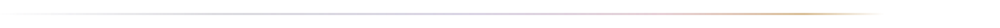

<!-- 東雲 dawn system — banner & rules live in /assets (outlined LXGW WenKai + Space Grotesk, no live text); the snake is generated by .github/workflows/snake.yml onto the `output` branch -->

 

<picture>
  <source media="(prefers-color-scheme: dark)" srcset="assets/dawn-banner-dark.svg">
  <source media="(prefers-color-scheme: light)" srcset="assets/dawn-banner-light.svg">
  
</picture>

 

<strong>『真理是溶解世界万物的溶剂，因而绝无法在客观上存在』</strong>
  
<em>Truth is the solvent in which all things dissolve—and for that very reason, it can have no objective existence of its own.</em>

 

  <picture>
    <source media="(prefers-color-scheme: dark)" srcset="assets/dawn-rule-dark.svg">
    <source media="(prefers-color-scheme: light)" srcset="assets/dawn-rule-light.svg">
    
  </picture>

 
 

<picture>
  <source media="(prefers-color-scheme: dark)" srcset="https://raw.githubusercontent.com/xi-kari/xi-kari/output/dawn-snake-dark.svg">
  <source media="(prefers-color-scheme: light)" srcset="https://raw.githubusercontent.com/xi-kari/xi-kari/output/dawn-snake-light.svg">
  
</picture>

 
 

  <picture>
    <source media="(prefers-color-scheme: dark)" srcset="assets/dawn-rule-dark.svg">
    <source media="(prefers-color-scheme: light)" srcset="assets/dawn-rule-light.svg">
    
  </picture>

 

结构先行 · 系统思维 · 默认即用
 
structure first · systems thinking · useful defaults

 
 

東雲 — 天将明未明之色 · the sky just before dawn

 
